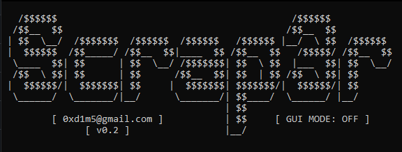

# Scrap3r
> Scraping job intern app BINUS ke .xlsx dengan python3.

# Note
- Pastikan ```firefox``` anda set default bahasa ke ```bahasa inggris``` atau ```bahasa indonesia```.
- Pastikan laptop / PC anda terinstall web browser ```firefox```, karena ini masih belum support dengan ```chrome```.
- Pastikan versi python yang terinstall adalah ```python 3.12```
- Karena ini project ```dadakan```, saya hanya memberikan ```sedikit handle error``` akan tetapi tidak semua saya tangani seperti try catch atau ```try exception``` pada saat ```login error```,``` network error```, dan kesalahan kesalahan ```umum``` lainnya.

# Installasi
1. Buka CMD / Git Bash / Terminal :
```git
git clone https://github.com/syauqqii/scrap3r
```
2. Masuk ke directory scrap3r :
```bash
cd scrap3r
```
3. Lakukan installasi modul :
```python3
pip install -r requirements.txt
```
4. Setting ```EMAIL_BINUS``` & ```PASSWORD``` anda di file ```.env```
5. Run program :
```python3
python main.py || python3 main.py
```

# Testing
- Windows 10 ```AMAN```
- Linux: Parrot OS (DEBIAN base) ```AMAN```

# Lapor BUG
- Jika menemukan error open ```issue``` saja atau email ke ```0xd1m5@gmail.com```

# Pemanis

