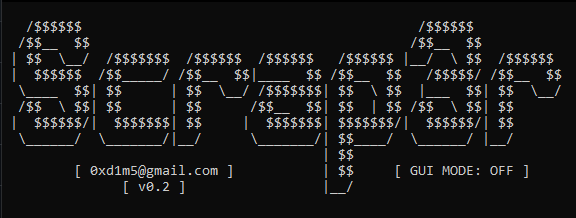

# Scrap3r
Scraping job intern app ke .xlsx dengan python.

# Note
- Pastikan laptop / PC anda terinstall web browser ```firefox```, karena ini masih belum support dengan ```chrome```.
- Pastikan versi python yang terinstall adalah ```python 3.x```

# Installasi
1. Buka CMD / Git Bash / Terminal : ```git clone https://github.com/syauqqii/scrap3r```
2. Masuk ke directory scrap3r : ```cd scrap3r```
3. Lakukan installasi modul : ```pip install -r requirements.txt```
4. Setting ```username``` & ```password``` anda di file ```env.py```
5. Run program : ```python main.py```


